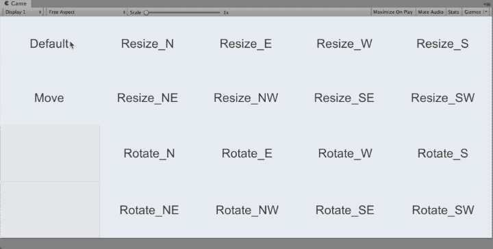

# UnitySimpleCursor



## Introduction
Change cursor for selection, panning, rotation, resizing.


## Usage

```cs
using System.Collections;
using System.Collections.Generic;
using UnityEngine;
using UnityEngine.EventSystems;

public class HoverElement : MonoBehaviour, IPointerEnterHandler, IPointerExitHandler
{
  public void OnPointerEnter(PointerEventData eventData)
  {
      SimpleCursor.CursorUtilities.ChangeCursor(CursorType.Resize_N);
  }

  public void OnPointerExit(PointerEventData eventData)
  {
      SimpleCursor.CursorUtilities.ChangeCursor(CursorType.Default);
  }
}
```

1. Call `SimpleCursor.CursorUtilities.ChangeCursor(CursorType type)` on hover.
2. Call `SimpleCursor.CursorUtilities.ChangeCursor(CursorType.Default)` on unhover.

Following CursorTypes are implemented.
- Default
- Move
- Resize_N
- Resize_E
- Resize_W
- Resize_S
- Resize_NE
- Resize_NW
- Resize_SE
- Resize_SW
- Rotate_N
- Rotate_E
- Rotate_W
- Rotate_S
- Rotate_NE
- Rotate_NW
- Rotate_SE
- Rotate_SW


## Environment
- Unity 2018.4.1f1
